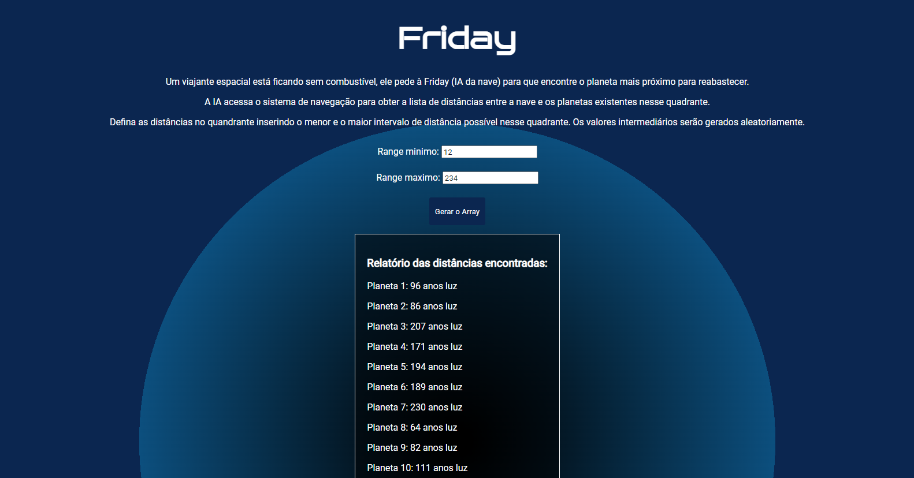

# Friday

**Número da Lista**: 41 
**Conteúdo da Disciplina**: D&C 

## Alunos
|Matrícula | Aluno |
| -- | -- |
| 16/0124581  |  Hugo Aragão de Oliveira |
| 20/2015984  |  Breno Henrique de Souza |

## Sobre 
O projeto tem como objetivo demonstar o funcionamento do algoritmo da Mediana das Medianas
em um exemplo fantasia que conta a história de um viajante do espaço.  

## Screenshots

Tela inicial:

Tela inicial com dados de quadrante:

Mostrando resultado:

## Instalação 
**Linguagem**: Javascript 
**Framework**: Não foi utilizado 

Para rodar o projeto é necessário ter acesso a internet para clonar o repositório, e ter um navegador instalado no computador(de preferência chrome ou edge), para rodar o projeto localmente.

## Uso 
Clone o repositório e execute o server utilizando a extensão Live Server no seu VsCode. A porta local é informada pela própria extensão quando executado.

Também é possível executar diretamente em seu navegador (caso tenha o projeto clonado em sua máquina), apenas copiando o path do arquivo index.html.

## Video da Apresentação  

[Link do Vídeo](https://youtu.be/kVW_5woSEAA)

